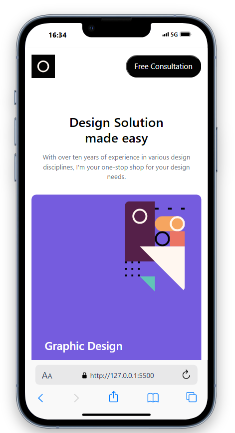
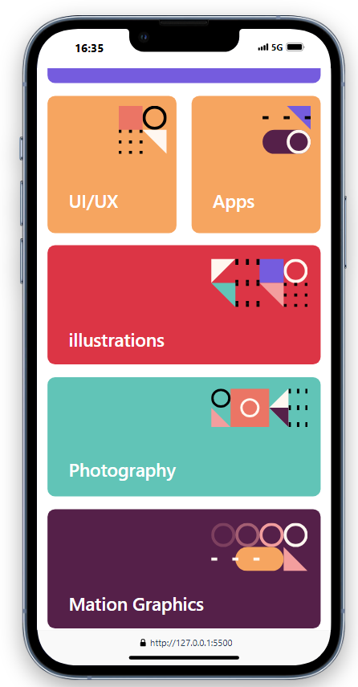
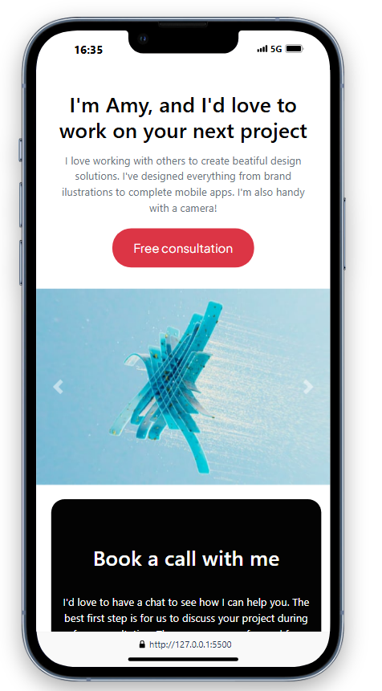
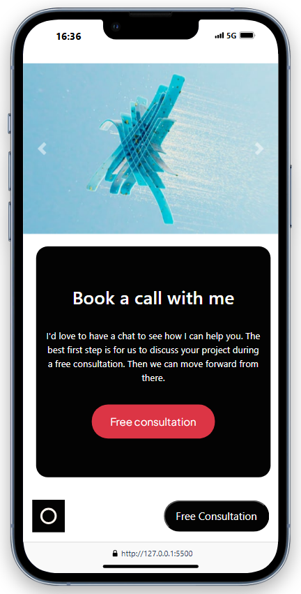

# Single-page design portfolio (MOBILE ONLY)

Esse exemplo de SPA é meu serviço de SPA mais barato disponível, ele tem apenas a versão mobile e leva apenas HTML e CSS basicamente, feito normalmente em apenas um dia. É amplamente utilizando quando o cliente quer apenas que tenha um link para o whatsapp para captar os leads através dos grupos. 

Quando a base de dados é pequena, vale a pena porquê ele economiza e coloca eles dentro de uma comunidade no proprio WhatsApp. Por lá é mais simples.

## Table of contents

- [Single-page design portfolio (MOBILE ONLY)](#single-page-design-portfolio-mobile-only)
  - [Table of contents](#table-of-contents)
  - [Overview](#overview)
    - [The challenge](#the-challenge)
    - [Screenshot](#screenshot)
    - [Links](#links)
    - [Built with](#built-with)

## Overview

### The challenge

Os usuários devem ser capazes de:

- Visualizar o layout ideal para o site no celular.
- Ver os estados de hover para todos os elementos interativos na página
- Navegar no slider usando o mouse/trackpad ou teclado

### Screenshot

### Links

- Solution URL: [Clique Aqui](https://github.com/vinycxuz/SPA_example)
- Live Site URL: [Clique Aqui](https://your-live-site-url.com)

### Built with

- Semantic HTML5 markup
- CSS custom properties
- Flexbox
- CSS Grid
- Mobile-first workflow
- Bootstrap

